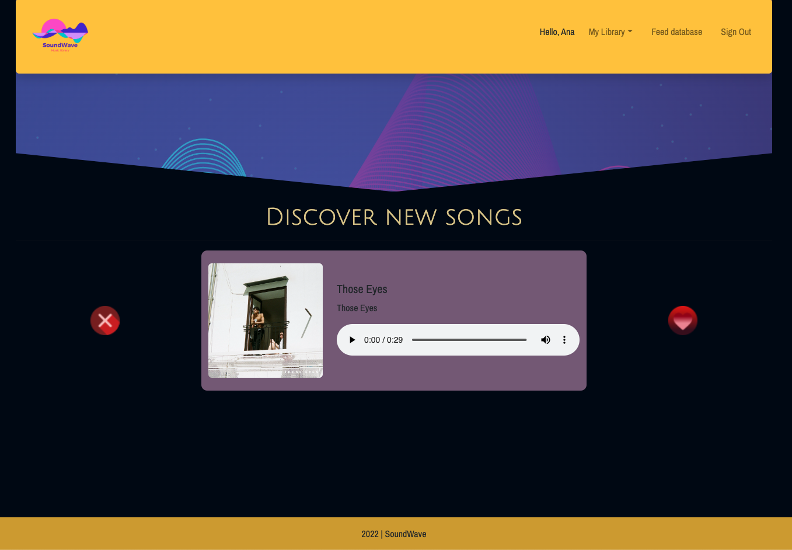

# SoundWave - music library

SoundWave quick listen and music library website. The user can either, on the main page, listen to a sample song and decide if they want to add it to their library or not. Because this is a small website, the user can also feed our library by pasting a Spotify link of the song they want to be part of SoundWave.

Once a song is part of the user's library, they also get some information about the artist and album related to it.

This project was designed for project1 for the Immersive Software Engineer course from General Assembly, where frameworks (Ruby on Rails) and database (PostgreSQL) were intended to be consolidated.

## Website

[SoundWave](https://musiclibrary-app.herokuapp.com/)

## Snapshot

## Stack
 * Ruby
 * Ruby on Rails
 * CSS + Bootstrap
 * HTML
 * Spotify API - **rSpotify gem**

## Future improvements
This website is still giving their first steps. I plan to use other API's to grab more information and images from the artists. Users should have followers, so then they can find others songs through each other. I'm also open to suggestions.

## Acknowledgements
Special thanks to [The Blade](https://github.com/wofockham) and  [Loden Gendun](https://github.com/Tenzang) for all the patience and guidance.
